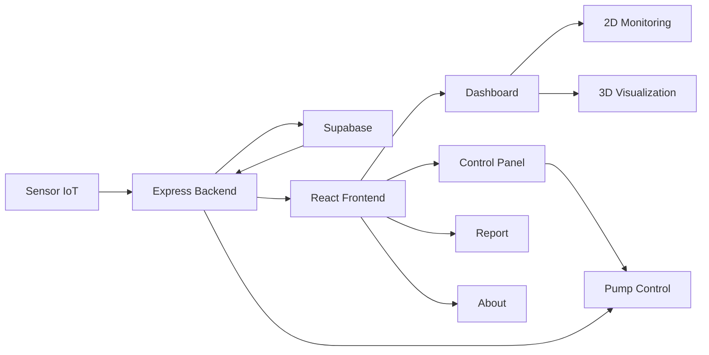

# 🌱 Smart Farming IoT Monitoring System

<div align="center">

### Sistem Monitoring dan Kontrol Irigasi Pertanian Berbasis IoT

Monitoring **11 petak lahan**, kontrol pompa otomatis,  
rain sensor dan humidity global, visualisasi 2D/3D, serta laporan data dalam satu platform.

<br />


</div>

---

## 📌 Tentang Proyek

**Smart Farming IoT Monitoring System** adalah aplikasi web full-stack yang dirancang untuk membantu proses monitoring kondisi lahan dan pengelolaan sistem irigasi pertanian.

Sistem memantau **11 petak lahan** secara individual menggunakan nilai **soil moisture**, sementara kondisi lingkungan seperti **rain sensor** dan **kelembapan udara (humidity)** berlaku secara global untuk seluruh area pertanian.

Data disimpan menggunakan **Supabase PostgreSQL**, diproses melalui REST API berbasis **Node.js + Express**, kemudian ditampilkan pada frontend **React + Vite**.

Sistem juga menyediakan visualisasi lahan dalam bentuk **2D Monitoring View** dan **3D Interactive Smart Farm** menggunakan Three.js.

---

## 🎯 Tujuan Sistem

Proyek ini dibuat untuk:

- Memantau kelembapan tanah pada setiap petak lahan.
- Mengetahui kondisi lingkungan pertanian secara global.
- Mengontrol pompa irigasi menggunakan mode AUTO atau MANUAL.
- Menghindari penyiraman yang tidak diperlukan ketika hujan.
- Memberikan informasi kondisi petak seperti Normal, Waspada, dan Kritis.
- Menampilkan kondisi lahan melalui dashboard 2D dan model 3D interaktif.
- Menyediakan laporan monitoring yang dapat diekspor ke CSV.

---

# ✨ Fitur Utama

## 🌱 Monitoring 11 Petak

Setiap petak memiliki data:

- Soil moisture
- Status pompa
- Mode kontrol
- Status kondisi tanah

Status kondisi tanah:

| Soil Moisture | Status |
|---|---|
| `< 25%` | 🔴 Kritis |
| `25% - 39%` | 🟡 Waspada |
| `>= 40%` | 🟢 Normal |

---

## 🌧️ Global Environment Monitoring

Kondisi lingkungan berlaku untuk seluruh area Smart Farming.

Data global yang digunakan:

- **Rain Sensor**
- **Humidity**
- **Weather Status**

Status cuaca:

```text
rain_detected = true
→ HUJAN

rain_detected = false
→ CERAH
```

Humidity hanya digunakan sebagai informasi monitoring dan **tidak menentukan status hujan ataupun kontrol pompa**.

---

## 💧 Smart Irrigation

Sistem mendukung dua mode kontrol:

### AUTO

Pada kondisi **CERAH**:

```text
Soil Moisture < 25%
→ Pompa ON
```

```text
Soil Moisture >= 25%
→ Pompa OFF
```

### MANUAL

Pengguna dapat mengontrol pompa secara langsung melalui **Control Panel**.

---

## 🌧️ Rain Override

Rain sensor memiliki prioritas tertinggi dalam sistem kontrol.

Jika hujan terdeteksi:

```text
HUJAN
↓
GLOBAL OVERRIDE
↓
SEMUA POMPA OFF
```

Rain override tetap berlaku walaupun petak menggunakan mode MANUAL.

---

# 🖥️ Halaman Aplikasi

## 🏠 Home

Landing page Smart Farming yang menampilkan:

- Informasi sistem
- Fitur utama
- Alur kerja
- Preview monitoring
- Teknologi yang digunakan

---

## 📊 Dashboard

Dashboard digunakan untuk monitoring kondisi Smart Farming.

Fitur Dashboard:

- Ringkasan kondisi lahan
- Rain sensor global
- Humidity global
- Status pompa
- Mode AUTO
- Early warning
- Grafik soil moisture
- Distribusi kondisi petak
- Rekomendasi sistem
- Tabel sensor dan aktuator
- Visualisasi 2D
- Visualisasi 3D

### Visualisasi 2D / 3D

Dashboard menggunakan **2D View sebagai tampilan default** agar halaman dapat dimuat lebih cepat.

```text
Dashboard
   ↓
2D Monitoring View
   ↓
User memilih "Visualisasi 3D"
   ↓
Three.js dimuat
   ↓
Interactive Smart Farm 3D
```

Model 3D menggunakan **lazy loading**, sehingga Three.js hanya dimuat ketika pengguna memilih mode 3D.

---

## 🎛️ Control Panel

Control Panel digunakan untuk mengatur sistem secara langsung.

Fitur:

- Simulasi Rain Sensor
- Kontrol humidity global
- Menjalankan AUTO Control
- Mengubah mode AUTO / MANUAL
- Menyalakan atau mematikan pompa pada mode MANUAL
- Monitoring soil moisture setiap petak

Ketika rain sensor mendeteksi hujan, semua kontrol pompa ON akan diblokir.

---

## 📄 Report

Halaman Report menyediakan ringkasan kondisi Smart Farming dalam format laporan.

Informasi yang ditampilkan:

- Executive Summary
- Environment Status
- Operation Status
- Field Condition
- System Findings
- Detail setiap petak
- Report Notes

Report juga menyediakan fitur:

```text
Export CSV
```

Data CSV mencakup informasi soil moisture, kondisi tanah, pompa, mode kontrol, rain sensor, humidity global, dan waktu laporan.

---

## ℹ️ About

Halaman About menjelaskan:

- Smart Farming IoT
- Tujuan sistem
- Fitur utama
- Alur kerja sistem
- Teknologi yang digunakan
- Informasi project / developer

---

# 🧠 Logika Sistem

Berikut prioritas utama sistem:

```text
RAIN SENSOR
     │
     ├── HUJAN
     │     ↓
     │  Semua Pompa OFF
     │
     └── CERAH
           ↓
      Cek Control Mode
           │
           ├── AUTO
           │     ↓
           │  Cek Soil Moisture
           │     │
           │     ├── < 25% → ON
           │     └── >=25% → OFF
           │
           └── MANUAL
                 ↓
            Kontrol User
```

---

# 🗄️ Struktur Database

Sistem menggunakan dua sumber data utama.

## `sensor_data`

Menyimpan data individual setiap petak.

| Kolom | Fungsi |
|---|---|
| `id` | ID data |
| `plot_number` | Nomor petak |
| `area` | Nama / area petak |
| `soil_moisture` | Kelembapan tanah |
| `pump_status` | ON / OFF |
| `control_mode` | AUTO / MANUAL |
| `created_at` | Waktu data dibuat |

Contoh:

```json
{
  "id": 1,
  "plot_number": 1,
  "area": "Petak 1",
  "soil_moisture": 18,
  "pump_status": "ON",
  "control_mode": "AUTO"
}
```

---

## `farm_environment`

Menyimpan kondisi lingkungan global.

| Kolom | Fungsi |
|---|---|
| `id` | ID environment |
| `humidity` | Kelembapan udara global |
| `rain_detected` | Status rain sensor |
| `weather_status` | CERAH / HUJAN |
| `updated_at` | Waktu update |

Contoh:

```json
{
  "id": 1,
  "humidity": 91,
  "rain_detected": false,
  "weather_status": "CERAH"
}
```

---

# 🏗️ Arsitektur Sistem



Alur sederhananya:

```text
Sensor
  ↓
Backend Express
  ↓
Supabase
  ↓
Frontend React
  ↓
Dashboard / Control / Report
  ↓
Pump Control
```

---

# 🛠️ Tech Stack

## Frontend

| Teknologi | Fungsi |
|---|---|
| React | User Interface |
| Vite | Development & Build Tool |
| React Router | Routing halaman |
| Recharts | Grafik monitoring |
| Three.js | Visualisasi Smart Farm 3D |
| Lucide React | Icon UI |
| CSS | Styling aplikasi |

## Backend

| Teknologi | Fungsi |
|---|---|
| Node.js | JavaScript runtime |
| Express.js | REST API |
| Supabase JS | Database client |
| dotenv | Environment variables |
| CORS | Cross-origin configuration |

## Database

| Teknologi | Fungsi |
|---|---|
| Supabase PostgreSQL | Penyimpanan data Smart Farming |

---

# 📂 Struktur Proyek

```text
monitoring_smartfarming/
│
├── backend/
│   ├── server.js
│   ├── supabaseClient.js
│   ├── package.json
│   ├── .env
│   │
│   └── scripts/
│       └── testLatency.js
│
├── frontend/
│   ├── src/
│   │
│   ├── components/
│   │   ├── Farm2DOverview/
│   │   │   ├── Farm2DOverview.jsx
│   │   │   └── Farm2DOverview.css
│   │   │
│   │   ├── Farm3DModel/
│   │   │   ├── Farm3DModel.jsx
│   │   │   └── Farm3DModel.css
│   │   │
│   │   ├── Navbar/
│   │   └── SensorTable/
│   │
│   ├── pages/
│   │   ├── HomePage.jsx
│   │   ├── DashboardPage.jsx
│   │   ├── ControlPanelPage.jsx
│   │   ├── ReportPage.jsx
│   │   └── AboutPage.jsx
│   │
│   ├── utils/
│   │   └── farmUtils.js
│   │
│   ├── App.jsx
│   └── main.jsx
│
└── README.md
```

> Struktur folder dapat menyesuaikan konfigurasi project yang digunakan.

---

# 🔌 REST API

Backend berjalan secara default pada:

```text
http://localhost:5000
```

Beberapa endpoint utama:

| Method | Endpoint | Fungsi |
|---|---|---|
| GET | `/api/sensors` | Mengambil data seluruh petak |
| GET | `/api/environment` | Mengambil kondisi environment global |
| GET | `/api/summary` | Mengambil ringkasan kondisi lahan |
| PUT | `/api/environment/rain` | Mengubah rain sensor |
| PUT | `/api/environment/humidity` | Mengubah humidity global |
| PUT | `/api/pump/:id` | Mengontrol pompa |
| PUT | `/api/control-mode/:id` | Mengubah AUTO / MANUAL |
| POST | `/api/auto-control` | Menjalankan kontrol otomatis |

---

# 🚀 Instalasi

## 1. Clone Repository

```bash
git clone https://github.com/USERNAME/NAMA-REPOSITORY.git
```

Masuk ke project:

```bash
cd NAMA-REPOSITORY
```

---

## 2. Install Backend

```bash
cd backend
npm install
```

Buat file:

```text
backend/.env
```

Isi:

```env
SUPABASE_URL=YOUR_SUPABASE_URL
SUPABASE_KEY=YOUR_SUPABASE_KEY
PORT=5000
```

Jalankan backend:

```bash
npm run dev
```

atau:

```bash
node server.js
```

Backend:

```text
http://localhost:5000
```

---

## 3. Install Frontend

Buka terminal baru:

```bash
cd frontend
npm install
npm run dev
```

Frontend:

```text
http://localhost:5173
```

---

# 🔐 Environment Variables

Jangan upload file `.env` ke GitHub.

Pastikan `.gitignore` memiliki:

```gitignore
.env
node_modules/
dist/
```

Contoh environment backend:

```env
SUPABASE_URL=https://your-project.supabase.co
SUPABASE_KEY=your-key
PORT=5000
```

---

# 📊 Status Sistem

Versi saat ini memiliki:

```text
✅ Monitoring 11 Petak
✅ Soil Moisture Monitoring
✅ Global Rain Sensor
✅ Global Humidity
✅ AUTO / MANUAL Control
✅ Rain Override
✅ Smart Irrigation
✅ Dashboard Analytics
✅ 2D Farm Monitoring
✅ Interactive 3D Farm
✅ Lazy Load 3D
✅ Early Warning
✅ Decision Support
✅ Report Page
✅ CSV Export
✅ Responsive UI
✅ Supabase Integration
```

---

# 🌱 Smart Farming Logic Summary

```text
HUJAN
→ Semua pompa OFF

CERAH + AUTO
→ Soil < 25%  → Pump ON
→ Soil >= 25% → Pump OFF

CERAH + MANUAL
→ User mengontrol pompa

Humidity
→ Monitoring lingkungan saja
```

---

# 👨‍💻 Developer

Smart Farming IoT Monitoring System

GitHub:

```text
https://github.com/solternaindonesia-dotcom
```

Repository:

```text
https://github.com/solternaindonesia-dotcom/MonitoringSmartFarming.git
```

---

<div align="center">

### 🌱 Smart Farming IoT

**Monitoring • Automation • Irrigation • Visualization**

Built with React, Express, Supabase & Three.js.

</div>